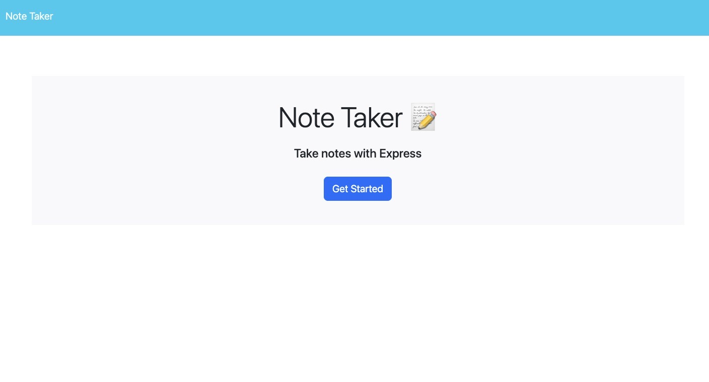
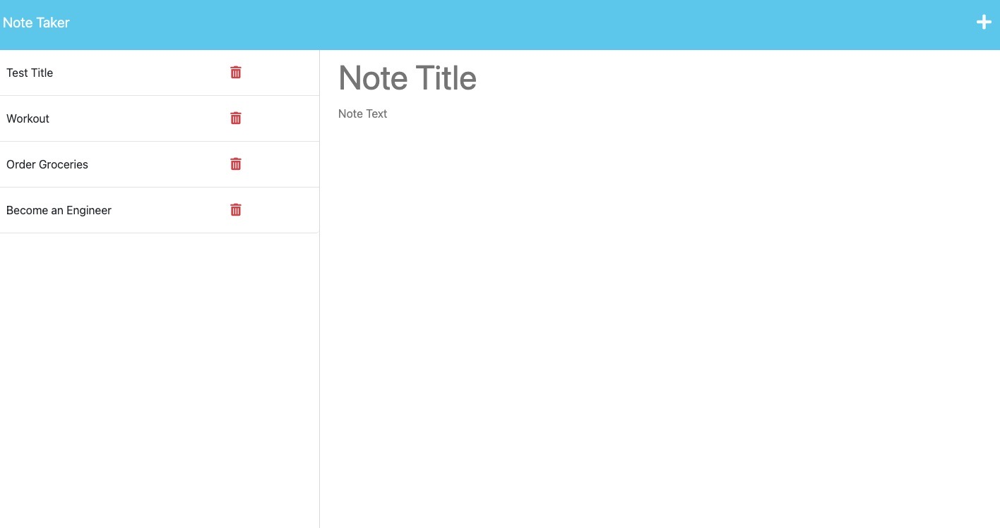

# note_taker-with_Express.js

## Description

The purpose of this project was to create an application that has the ability to create, save and delete notes with a note taker. This application uses Express.js on the back end and saves and retieves user generated note data from JSON file. The Note Taker application allows you to enter in the title and text on your note taker app and save the items as a way to keep track of tasks. The application's front end was previously created and as a developer, it was my responsibility to build the back end and connect the two, then deploy completed application to Heroku. 

## Table of Contents

- [Installation](#installation)
- [Usage](#usage)
- [Credits](credits)
- [License](#license)
- [Tests](#tests)
- [Features](#features)
- [Questions](#questions)

## Installation:

- npm i
- Node.js
- express.js

## Usage:

- Application Screenshot:

- 
- 

- [Repository URL](https://github.com/bundleofcodes/note_taker-with_Express.js)

## Credits:

- Raiya Young
- Georgia Tech Coding Bootcamp
- Mazin Abed
- Youtube.com
- Pham Ngan
- Jacob Willis

## License:

This project is licensed under MIT License. Click [here](https://github.com/bundleofcodes/note_taker-with_Express.js/blob/main/LICENSE)

## Tests:

No tests available

## Features:

- Saved Task Notes

## Questions:

If you have questions about this repo, open an issue or contact me directly at realdeveloper@gmail.com. You can also find more of my work at [Bundleofcodes](https://github.com/bundleofcodes)